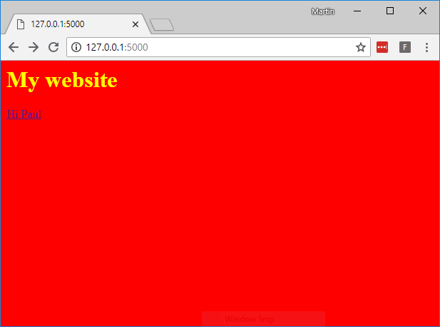

## Introduktion

### Hvad skal du have

Du sætter en web server op og laver en simpel hjemmeside med Flask, Python og HTML/CSS

Web serveren vil kunne reagere på dynamisk indhold som en bruger giver. Altså din hjemmeside vil kunne mere end bare vise statisk information.

--- collapse ---

---
title: Hvad har du brug for
---

### Hardware

+ En computer der kan køre Python 3 (Det kan alle)

### Software

+ [Python 3](https://www.python.org/downloads/)

--- /collapse ---

--- collapse ---

---
title: Hvad du vil lære
---

- Hvordan man installerer Python moduler med `pip`
- Hvordan man bygger en enkel web app med Python og Flask

Denne ressurse dækker elementer fra de følgende dele af [Raspberry Pi Digital Making Curriculum](https://www.raspberrypi.org/curriculum/):
- [Apply abstraction and decomposition to solve more complex problems](https://curriculum.raspberrypi.org/programming/developer/)

--- /collapse ---

--- no-print ---

Hvis du har brug for at printe projektet ud på papir, så benyt denne [papir og printer venlige version](https://projects.raspberrypi.org/en/projects/python-web-server-with-flask/print){:target="_blank"}.

--- /no-print ---
