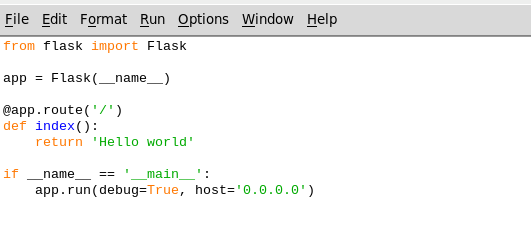
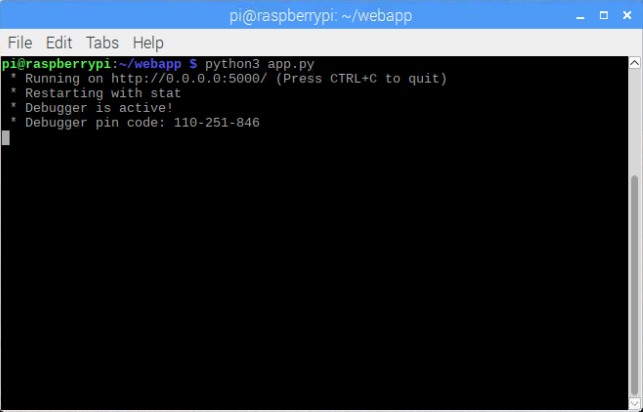
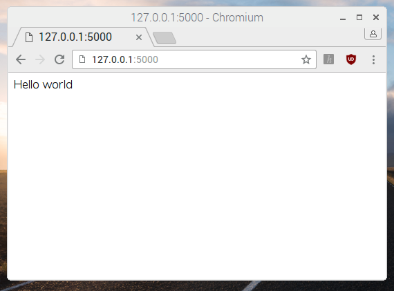

## Byg en Flask Hjemmeside

Det første vi skal gøre, er at lave en enkel web applikation med Flask og Python.

Hvis du ikke har Python 3 på din computer, er du nødt til at installere det.

--- task ---

[Hent Python 3](https://www.python.org/downloads/) og installer det.

[[[generic-python-install-python3]]]

--- /task ---

Du har også behov for at installer Flask pakken.

--- task ---

Installer `flask` Python modulet ved at bruge `pip`. Du skal være forbundet til internettet før du kan begynde.

[[[generic-python-installing-with-pip]]]

--- /task ---

Når Flask er installeret, kan du oprette din web applikation.

--- task ---

Åben en terminal eller et vindue i kommandoprompt, og brug `mkdir` kommandoen til at lave en ny mappe der hedder `webapp`.

```bash
mkdir webapp
```

--- /task ---

--- task ---

Brug 'change directory' kommandoen `cd` til at åbne den nye mappe.

```bash
cd webapp
```
--- /task ---

--- task ---

Åben Python 3 IDLE, og lav en ny fil ved at trykke på **File** og så på **New file**.

--- /task ---

--- task ---

Gem den nye fil med navnet `app.py` inde i `webapp` mappen.

--- /task ---

--- task ---

Skriv nu de følgende linjer kode i `app.py` filen:

```python
from flask import Flask

app = Flask(__name__)

@app.route('/')
def index():
    return 'Hello world'

if __name__ == '__main__':
    app.run(debug=True, host='0.0.0.0')
```



Vi vil dykke ned i koden senere i næste skridt. Lige nu skal vi tjekke at koden virker.

--- /task ---

--- task ---

Gem dine ændringer ved at trykke på  **File** og så på **Save**,  eller ved at trykke <kbd>Ctrl</kbd> og <kbd>S</kbd> på samme tid.

--- /task ---

Du er så nødt til at køre din web app fra a terminalen/kommandoprompten du åbnede tidligere.

--- task ---

### On Raspberry Pi/Linux/macOS

Skriv kommandoen `python3 app.py` i terminal vinduet.

### On Windows

Skriv kommandoen `python app.py` i kommandoprompt vinduet.

--- /task ---

Hvis din kode er korrekt, så skulle vinduet vise dig noget i retningen af det her:

```
 * Running on http://0.0.0.0:5000/ (Press CTRL+C to quit)
 * Restarting with stat
 * Debugger is active!
 * Debugger pin code: ***-***-***
```



--- task ---

Åben nu din browser og skriv URL'en `http://127.0.0.1:5000/`. Du burde se en hvid skærm med ordene `Hello world`.

**Note:** `127.0.0.1` betyder 'home', i.e. altså din computer. `:5000` betyder 'port 5000', hvilket er porten web serveren kører på.

--- /task ---


