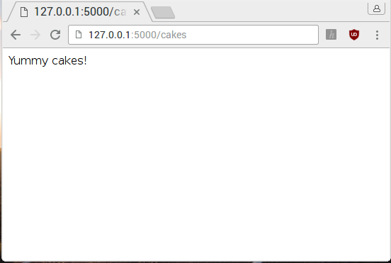

## Tilføj en ny side

Nu skal du tilføje en ny side til din web app ved at lave en ny **route**.

I en web applikation, er en route en bestemt sti ind i din hjemmeside. Stien er bestemt af den URL soms brugeren skriver i deres web browser's adressefelt. Du laver routes(ruter) og bestemmer hvad hver route skal gøre.

I koden du allerede har i  `app.py`, er der en enkelt route:

```python
@app.route('/')
def index():
    return 'Hello world'
```

Denne route er lavet af 3 dele:

- `@app.route('/')`: bestemmer indgangspunktet; symbolet `/` betyder roden af hjemmesiden, altså `http://127.0.0.1:5000/`
- `def index()`: er navnet du giver ruten, i dette tilfælde `index`, fordi det er indekset (eller forside) på hjemmesiden.
- `return 'Hello world'`: er indholdet på din hjemmeside, som bliver returneret når brugeren går ind på denne URL.

Den anden halvdel af  `app.py` koden kører web serveren og din app:

```python
if __name__ == '__main__':
    app.run(debug=True, host='0.0.0.0')
```

**Note:** `host='0.0.0.0'` betyder din web app er tilgængeligt til alle enheder på netværket.

De følgende instrukser viser hvordan man laver en ny side og rute der hedder 'cakes'. Hvis du vil, kan du ændre navnet og indholdet til det du vil.

--- task ---

For at lave en ny side og en rute til den, tilføj disse linjer kode, som set nedenunder, hvor den første side og rute bliver lavet i `app.py`:

```python
@app.route('/cakes')
def cakes():
    return 'Yummy cakes!'
```

--- /task ---

--- collapse ---

---
title: Den færdige kode
---

Dit færdige kode burde se sådan her ud:

```python
from flask import Flask

app = Flask(__name__)

@app.route('/')
def index():
    return 'Hello world'

@app.route('/cakes')
def cakes():
    return 'Yummy cakes!'

if __name__ == '__main__':
    app.run(debug=True, host='0.0.0.0')
```

--- /collapse ---

--- task ---

Gem din kode og naviger til 'cakes' siden i din browser på adresssen `127.0.0.1:5000/cakes`. Du burde se en hjemmeside med teksten "Yummy cakes!" på den.



--- /task ---
