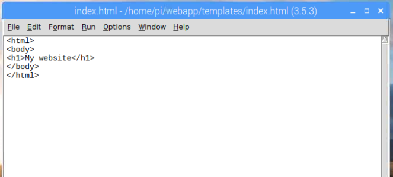
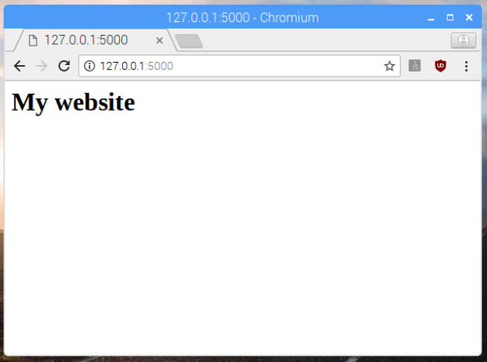

## Returner HTML web sider

Nu skal du modificere dine eksisterende ruter til at returnere en fuld HTML web side, i stedet for almindelig tekst.

HTML web siden vil blive lavet fra en skabelon eller **template** som holder det statiske indhold af siden. I en senere sektion af dette projekt, vil du lære hvordan man indsætter data så man har en dynamisk version af siden.

--- task ---

Først, lav et  `templates` mappe i din `webapp` mappe ved at skrive den følgende kommando i terminalen eller kommandoprompt vinduet:

```bash
mkdir templates
```

--- /task ---

--- task ---

Lav en ny fil i IDLE ved at trykke på **File** og **New File**, og gem filen som `index.html` i din  `templates` mappe.

--- /task ---

--- task ---

Skriv den følgende HTML kode i `index.html`:

```html
<html>
<body>
<h1>My website</h1>
</body>
</html>
```



--- /task ---

--- task ---

Gem dine ændringer ved at trykke **File** og **Save**, eller ved at trykke <kbd>Ctrl</kbd> og <kbd>s</kbd>.

--- /task ---

--- task ---

Gå tilbage til din `app.py` fil i IDLE, og modificer den første linje af ddin kode for også at importere `render_template` funktionen fra `flask` modulet:

```python
from flask import Flask, render_template
```

--- /task ---

--- task ---

Slutteligt, modificer din `index()` funktion til at returnere  `index.html` HTML templaten i stedet for den normale tekst. Rediger kodden inde i funktionsdefinitionen så koden ser sådan her ud:

```python
@app.route('/')
def index():
    return render_template('index.html')
```

Denne kode for Flask til at kigge efter `index.html` i `templates` mappen som `app.py` programet er i.

--- /task ---

--- task ---

Gem filen. Vær sikker på at dit `app.py` program stadig kører. Hvis ikke, så kør det igen ved at bruge terminalen/kommandoprompten.

--- /task ---

--- task ---

Indlæs `http://127.0.0.1:5000/` siden i din web browser for at se dit nye HTML template blive vist.



I dette tilfælde er hvad du ser ikke meget anderledes, fordi det eneste nye er en HTML header. Der er dog bedre mulighed for at tilføje mere!

--- /task ---
