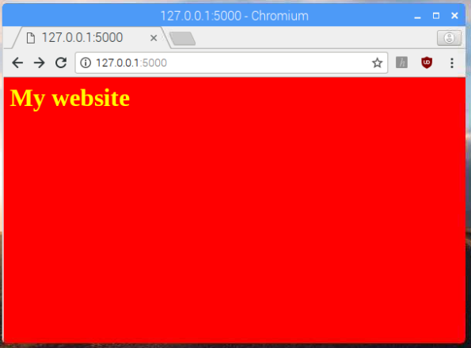

## Tilføj farver med CSS

Nu skal du tilføje noget Cascading Style Sheets (CSS) for at tilføje farve til din hjemmesisde. Cascading Style Sheets er regler for hvordan en brwoser viser HTML indhold.

--- task ---

Først, gå tilbage til terminal/kommandoprompt vinduet og naviger til `webapp` mappen. Hvis du er i  `templates` directory,  gå et level op med kommandoen `cd ..`.

--- /task ---

--- task ---

Lav et nyt mappe der hedder  `static`.

```bash
mkdir static
```

--- /task ---

--- task ---

Lav en ny fil i IDLE ved at trykke på  **File** og **New File**, og gem filen som `style.css` i`static` mappen.

--- /task ---

--- task ---

Tilføj de følgende CSS regler til filen:

```css
body {
    background: red;
    color: yellow;
}
```


**Note:** denne kode indeholder farvenavne, men du kan også bestemme farver ved at bruge hex koder som `#ff0000` (rød).

--- /task ---

--- task ---

Gem dine ændringer.

--- /task ---

--- task ---

Modificer nu din `index.html` HTML template til at inkludere CSS ved at tilføje en `<head>` tag der indeholder et `<link>` tag med en reference til style sheet filen:

```html
<html>
<head>
<link rel="stylesheet" href='/static/style.css' />
</head>
<body>
<h1>My website</h1>
</body>
</html>
```

--- /task ---

--- task ---

Gem ændringer til `index.html` og genindlæs din browser. Du burde nu se en mere farverig version af din web app!



--- /task ---

Hvis din web app ikke ser helt rigtigt ud, kan det være din CSS fil ikke er i den rigtige mappe.

Du har nu en række af filer og mapper i din web app. Det er værd at tjekke om din  `webapp` projektmappe indeholder de følgende filer og har den følgende struktur:

```
├── app.py
├── static
│   └── style.css
└── templates
    └── index.html
    └── cakes.html
```
