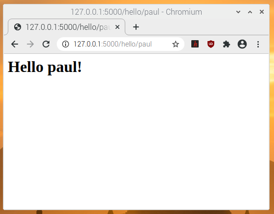
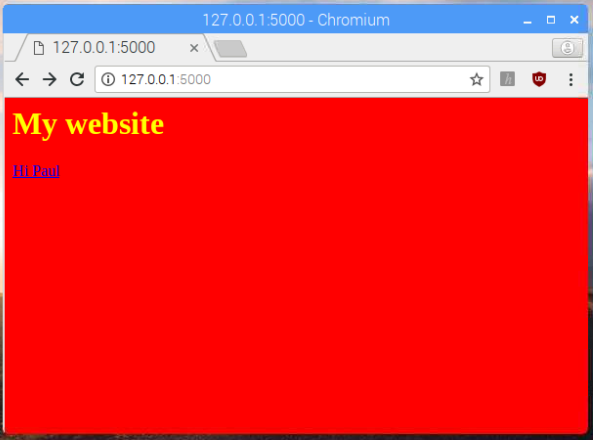

## Tilføj dynamisk indhold

Nu ved du hvordan man leverer statisk HTML hjemmesider ved at bruge templates(skabeloner). Store hjemmesider som Facebook, Youtube og DR har dynamis indhold: disse hjemmesider viser forskelligt indhold på de forskellige sider du besøger, selvom skabelonerne på siderne er meget ens.

Du vil nu tilføje dynamisk indhold til dine sider så du kan vise forskellige information.

Nu skal du lave en ny rute på din hjemmeside så når du går til `http://127.0.0.1/hello/name`, så siger siden 'Hello name!', hvor du erstatter 'name' med hvad end du skriver der. For eksempel, `/hello/Dana/` viser 'Hello Dana!'.

--- task ---

Tilføj den følgende kode til at lave en ny rute i din applikation:

```python
@app.route('/hello/<name>')
def hello(name):
    return render_template('page.html', name=name)
```

- `@app.route('/hello/<name>')`: Kodedelen `<name>` betyder den putter navnet ind i `hello` funktionen som en variabel der hedder `name`.
- `def hello(name)`: dette er funktionen der bestemmer hvilket indhold der skal vises. Her vil funktionen take det givne navn som parameter.
- `return render_template('page.html', name=name)`: denne kode vil slå skabelonen `page.html` op og sende variablen `name` fra URL stien ind, så skabelonen kan bruge den.

--- /task ---

--- task ---

Lav en ny HTML skabelon som hedder `page.html`, og tilføj det følgende HTML kode til det:

```html
<html>
<body>
<h1>Hello {{ name }}!</h1>
</body>
</html>
```

--- /task ---

--- task ---

Gem filerne og besøg `http://127.0.0.1:5000/hello/paul`. Siden du ser burde se sådan ud:



Prøv `http://127.0.0.1/hello/name` med forskellige navne!

--- /task ---

--- collapse ---

---
title: Hvad sker der her?
---

Flask bruger `jinja`, et Python bibliotek til at tegne skabeloner. Se på denne kode med krøllede paranteser:

```html
<h1>Hello {{ name }}!</h1>
```

Denne kode fortæller skabelonen at tegne variablen `name` så den passer ind i rute funktionen `hello`.

Når man besøger `127.0.0.1:5000/hello/` uden et navn, vil den lave en fejl. Prøv at tænk på en måde man undgår denne fejl.

--- /collapse ---

--- task ---

Lav et link til din nye dynamiske "hello" side fra din indeks side.

Rediger `index.html` til at have en link til din "hello" side under overskriften.

```html
<h1>My website</h1>
<a href="/hello/paul">Hi Paul</a>
```

--- /task ---

--- task ---

Gem ændringerne til`index.html`, og så genindlæs index siden i din browser for at se den opdaterede version.



--- /task ---
