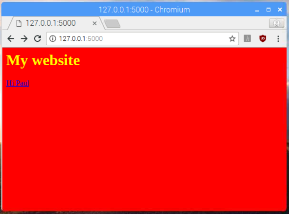

## What you will make

Set up a web server and create a simple website using Flask, Python, and HTML/CSS. 
The web server will be able to react to the dynamic content that the user inputs.

### You will need:
- A Raspberry Pi with the latest Raspberry Pi OS 

--- collapse ---
---
title: Installing Flask
---

`Flask` should be pre-installed as part of Raspberry Pi OS, so you shouldn't need to do anything.

You can install it manually with the command:

--- code ---
---
language: bash
line_numbers: false
---
sudo apt install python3-flask

--- /code ---

--- /collapse ---