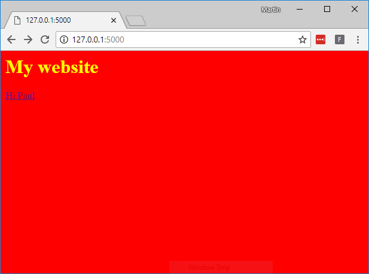

## Introduction

### What you will make

You'll set up a web server and create a simple website using Flask, Python, and HTML/CSS.

The web server will be able to react to the dynamic content that the user inputs, so your website will be a web application that can more than just show static information.

--- collapse ---

---
title: What you will need
---

### Hardware

+ A computer capable of running Python 3

### Software

+ [Python 3](https://www.python.org/downloads/)

--- /collapse ---

--- collapse ---

---
title: What you will learn
---

- How to install Python modules using `pip`
- How to build a basic web app with Python and Flask

This resource covers elements from the following strands of the [Raspberry Pi Digital Making Curriculum](https://www.raspberrypi.org/curriculum/):
- [Apply abstraction and decomposition to solve more complex problems](https://curriculum.raspberrypi.org/programming/developer/)

--- /collapse ---

--- no-print ---

If you need to print this project, please use the [printer-friendly version](https://projects.raspberrypi.org/en/projects/python-web-server-with-flask/print){:target="_blank"}.

--- /no-print ---

