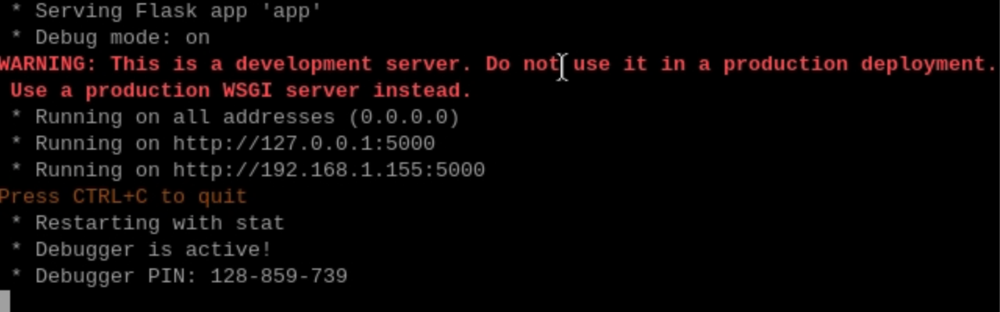
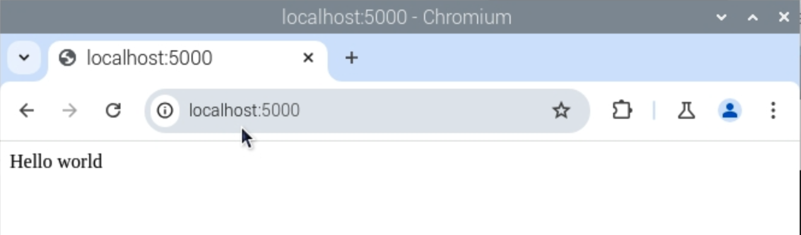

## Create the app

--- task ---
Open a terminal and use the `mkdir` command to create a new directory inside your documents folder called `webapp`.

--- code ---
---
language: bash
line_numbers: false
---
mkdir ~/Documents/webapp
--- /code ---

--- /task ---

--- task ---

Use the 'change directory' command `cd` to open the new directory.

--- code ---
---
language: bash
line_numbers: false
---
cd ~/Documents/webapp
--- /code ---
--- /task ---

--- task ---
From the **Programming** menu, open **Thonny**.
--- /task ---
--- task ---

Add this Python code into the blank file.

--- code ---
---
language: python
line_numbers: false
---
from flask import Flask

app = Flask(__name__)

@app.route('/')
def index():
    return 'Hello world'

if __name__ == '__main__':
    app.run(debug=True, host='0.0.0.0')
--- /code ---
--- /task ---

--- task ---
Save the new file with the name `app.py` inside the `webapp` folder you just created.
--- /task ---

--- task ---
Go back to your terminal window and run the script you just wrote:

--- code ---
---
language: bash
line_numbers: false
---
python3 app.py
--- /code ---

--- /task ---

If everything is working correctly, the window should show you output similar to this:

--- task ---
From your Raspberry Pi's menu, open **Internet** > **Chromium web browser**
--- /task ---

--- task ---
In the address bar, type `localhost:5000` and press <kbd>Enter</kbd>. You should see the welcome page.

--- /task ---

