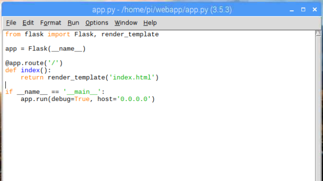

## Create the app

--- task ---
Open a terminal or command prompt window, and use the `mkdir` command to create a new directory called `webapp`.

```bash
mkdir webapp
```

--- /task ---

--- task ---

Use the 'change directory' command `cd` to open the new directory.

```bash
cd webapp
```
--- /task ---

--- task ---

Open Python 3 IDLE, and create a new file by clicking on**File** and then on **New file**.

--- /task ---

--- task ---

Save the new file with the name `app.py` inside the `webapp` folder.

--- /task ---

--- task ---

Now enter the following lines of code into the `app.py` file:

```python
from flask import Flask

app = Flask(__name__)

@app.route('/')
def index():
    return 'Hello world'

if __name__ == '__main__':
    app.run(debug=True, host='0.0.0.0')
```



You will explore this code in more detail in the next step. But first, make sure the code works.

--- /task ---

--- task ---

Save your changes by clicking on **File** and then on **Save**, or by pressing <kbd>Ctrl</kbd> and <kbd>S</kbd> at the same time. 

--- /task ---

You need to run your web app from the terminal/command prompt window you opened earlier.

--- task ---

### On Raspberry Pi/Linux/macOS

Enter the command `python3 app.py` into the terminal window.

### On Windows

Enter the command `python app.py` into the command prompt window.

--- /task ---

If your code is correct, the window should show you output similar to this:

```
 * Running on http://0.0.0.0:5000/ (Press CTRL+C to quit)
 * Restarting with stat
 * Debugger is active!
 * Debugger pin code: ***-***-***
```


--- task ---

Now open your web browser and enter the URL `http://127.0.0.1:5000/`. You should see a white screen with the words `Hello world`.

**Note:** `127.0.0.1` means 'home', i.e. your computer. `:5000` means 'port 5000', which is the port the web server is running on.

--- /task ---


