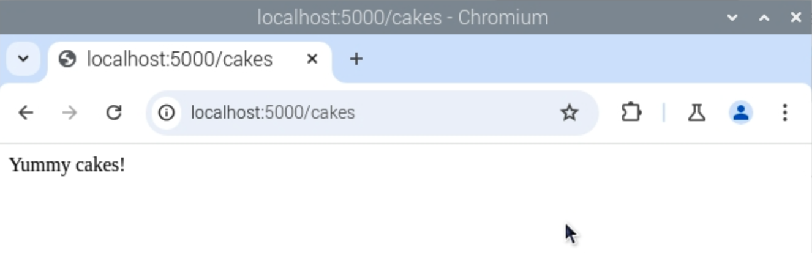

## Add another page

Now you're going to add a new page to your web app by creating a new **route**.

In a web application, a route is a certain path into your website, determined by the request a user sends by type into the web browser's address bar. It's up to you which routes are enabled and what each of them does.

In the 'Hello World' example, we used a single route:

```python
@app.route('/')
def index():
    return 'Hello world'
```

This route is made up of three parts:

- `@app.route('/')`: this determines the entry point; the `/` means the root of the website, so `http://127.0.0.1:5000/`
- `def index()`: this is the name you give to the route; this one is called `index`, because it's the index of the website
- `return 'Hello world'`: this is the content of the web page, which is returned when the user browses the index of the website

The following instructions will show how to create a new page and route called 'cakes', but feel free to change this name and content to be whatever you want.

--- task ---

Create a new route by adding these lines of code below the first route:

```python
@app.route('/cakes')
def cakes():
    return 'Yummy cakes!'
```

--- /task ---

--- collapse ---

---
title: Complete code
---

Your complete code should now look similar to this:

```python
from flask import Flask

app = Flask(__name__)

@app.route('/')
def index():
    return 'Hello world'

@app.route('/cakes')
def cakes():
    return 'Yummy cakes!'

if __name__ == '__main__':
    app.run(debug=True, host='0.0.0.0')
```

--- /collapse ---

--- task ---

Save your code and navigate to your 'cakes' page in the browser at `127.0.0.1:5000/cakes`. You should see a web page with the text 'Yummy cakes!' on it:



--- /task ---
