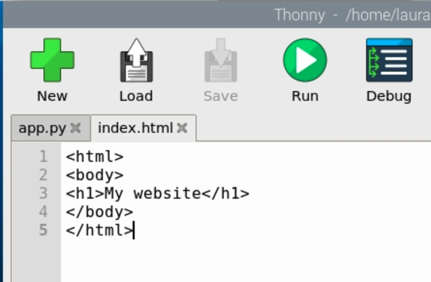

## Create a HTML template

You can use a **template** to give your page a style. The template will use **HyperText Markup Language (HTML)**. 

--- task ---
Go to your terminal and press <kbd>Ctrl</kbd> + <kbd>C</kbd> to stop your flask server.
--- /task ---

--- task ---
Create a `templates` directory in your `webapp` directory: 

--- code ---
---
language: bash
line_numbers: false
---
mkdir templates
--- /code ---

--- /task ---

--- task ---

Go back to **Thonny** and create a new file. Save this file as `index.html` inside your `templates` folder.

--- /task ---

--- task ---
Add this code to `index.html` and **save** your changes.

--- code ---
---
language: html
line_numbers: true
---
<html>
<body>
<h1>My website</h1>
</body>
</html>
--- /code ---

--- /task ---

--- task ---

--- /task ---

--- task ---

Return to your `app.py` file and change the first line of code:

--- code ---
---
language: python
line_numbers: true
---
from flask import Flask, render_template
--- /code ---

--- /task ---

--- task ---
Change the `index()` route to use your `index.html` HTML template:

--- code ---
---
language: python
line_numbers: true
line_number_start: 5
line_highlights: 7
---
@app.route('/')
def index():
    return render_template('index.html')
--- /code ---

--- /task ---

--- task ---

Save `app.py` then go back to the terminal and run it to restart your server:

--- code ---
---
language: bash
line_numbers: false
---
python3 app.py
--- /code ---

--- /task ---

--- task ---

Go to `localhost:5000/` page in **Chromium** to see your new HTML template displayed.

--- /task ---

