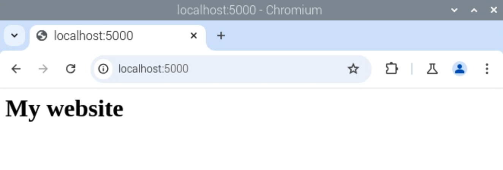

## Add HTML templates to your web app

Next, you'll modify your existing routes to return full HTML templates, rather than simple text.

--- task ---

First, create a `templates` directory in your `webapp` directory by entering this into the Terminal / Command Prompt:

```bash
mkdir templates
```

--- /task ---

--- task ---

Create a new file in IDLE by clicking **File**, **New File** and save this file as `index.html` in the `templates` folder you just created.

--- /task ---

--- task ---

Enter the following HTML code:

```html
<html>
<body>
<h1>My website</h1>
</body>
</html>
```


--- /task ---

--- task ---

Save your changes by clicking **File**, **Save** or pressing **Ctrl + S**. 

--- /task ---

--- task ---

Return to your `app.py` file in IDLE and modify the first line of your code to import the `render_template` function as well:

```python
from flask import Flask, render_template
```

--- /task ---

--- task ---

Finally, you'll need to modify your index function to return the HTML template instead of the normal text. Change the `index()` function to this:

```python
@app.route('/')
def index():
    return render_template('index.html')
```

Flask will look for the `index.html` in a directory called `templates`, in the same directory as the `app.py` file.

--- /task ---

--- task ---

Save the file. Make sure your `app.py` program is still running. If not, just run it again using the Terminal / Command Prompt.

--- /task ---

--- task ---

Load the `http://127.0.0.1:5000/` page in your web browser to see your new HTML template being displayed.



In this case it's not much different as all you've done is added a header, but there's plenty of scope to expand!

--- /task ---

