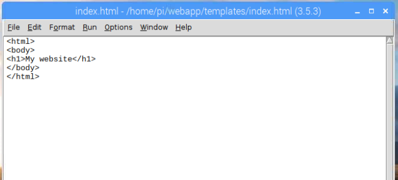

## Add HTML templates

Next, you'll modify your existing routes to return full HTML templates rather than just simple text.

--- task ---

First, create a `templates` directory in your `webapp` directory by entering this into the terminal or command prompt window:

```bash
mkdir templates
```

--- /task ---

--- task ---

Create a new file in IDLE by clicking **File** and **New File**, and save this file as `index.html` in your `templates` folder.

--- /task ---

--- task ---

Enter the following HTML code in `index.html`:

```html
<html>
<body>
<h1>My website</h1>
</body>
</html>
```



--- /task ---

--- task ---

Save your changes by clicking **File** and **Save**, or by pressing <kbd>Ctrl</kbd> and <kbd>s</kbd>. 

--- /task ---

--- task ---

Return to your `app.py` file in IDLE, and modify the first line of your code to import the `render_template` function from the `flask` module as well:

```python
from flask import Flask, render_template
```

--- /task ---

--- task ---

Finally, you'll need to modify your `index()` function to return the `index.html` HTML template instead of the normal text. Change the code inside the definition so that the code looks like this:

```python
@app.route('/')
def index():
    return render_template('index.html')
```

Flask will look for `index.html` in the same directory the `app.py` program is in, meaning `templates`.

--- /task ---

--- task ---

Save the file. Make sure your `app.py` program is still running. If it's not, just run it again using the terminal/command prompt.

--- /task ---

--- task ---

Load the `http://127.0.0.1:5000/` page in your web browser to see your new HTML template displayed.


In this case it's not much different, as all you've done is added a header, but there's plenty of scope to expand!

--- /task ---

