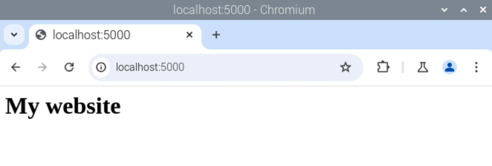

## Add HTML templates to your web app

Next, you'll modify your existing routes to return full HTML templates, rather than simple text strings.

- First, create a `templates` directory in your `webapp` directory by entering this into the Terminal:

    ```bash
    mkdir templates
    ```

- Open `Text Editor` under `Accessories` in the main menu:

    

    This will open up a basic text editor called Leafpad.

- Enter the following HTML code:

    ```html
    <html>
    <body>
    <h1>Hello from a template!</h1>
    </body>
    </html>
    ```

- Save the file as `index.html` in the `templates` directory, which you'll find inside the `pi` and then `webapp` directories.

- Return to your `app.py` file in IDLE and modify the first line of your code to import the `render_template` function as well:

    ```python
    from flask import Flask, render_template
    ```

- Finally, you'll need to modify your index view to return the HTML template instead of the normal text. Change the `index()` function to this:

    ```python
    @app.route('/')
    def index():
        return render_template('index.html')
    ```
    
    Flask will look for `index.html` in a directory called `templates`, in the same directory as the `app.py` file.

- Save the file. Make sure your web app is still running. If you stopped it, just run `python3 app.py` from your `webapp` directory.

- Reload the route in your web browser (go to the base route at `http://127.0.0.1:5000/`) to see your new HTML template being displayed.

    

    In this case it's not much different as all you've done is added a header, but there's plenty of scope to expand!

