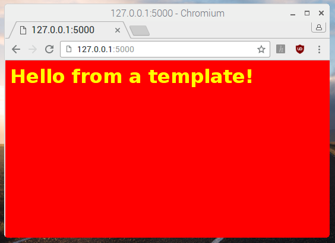

## Adding colour to the web page with CSS

Cascading Style Sheets (CSS) are rules for how HTML content is displayed by the browser. Now you'll add some CSS to add colour to your web page.

--- task ---

First, return to the Terminal / Command Prompt and navigate to the `webapp` directory. If you're in the `templates` directory, go back up one level with `cd ..`.

--- /task ---

--- task ---

Create a new directory called `static`.

```bash
mkdir static
```

--- /task ---

--- task ---

Create a new file in IDLE by clicking **File**, **New File** and save this file as `style.css` in the `static` folder you just created.

--- /task ---

--- task ---

Add the following CSS rules to the file:

```css
body {
    background: red;
    color: yellow;
}
```


**Note:** you have used colour names but you could also create colours using hex codes like `#ff0000` (red).

--- /task ---

--- task ---

Save your changes.

--- /task ---

--- task ---

Now modify your HTML template called `index.html` to include the CSS file, by adding a `<head>` tag containing a `<link>` tag with a reference to the stylesheet:

```html
<html>
<head>
<link rel="stylesheet" href='/static/style.css' />
</head>
<body>
<h1>My website</h1>
</body>
</html>
```

--- /task ---

--- task ---

Save the change to `index.html` and refresh your browser. You should see a colourful version of the web app!



--- /task ---

You have so far created a number of files and directories. It is worth just double-checking your `webapp` project directory, which should contain the following and have a structure like this now:

```
├── app.py
├── static
│   └── style.css
└── templates
    └── index.html
```

If your web app doesn't look right, check you saved your CSS file in the right place.

