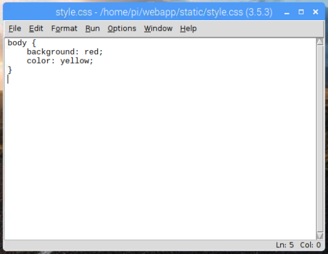

## Add colour with CSS

Now you'll add some Cascading Style Sheets (CSS) to add colour to your web page. Cascading Style Sheets are rules for how a browser displays HTML content.

--- task ---

First, return to the terminal/command prompt window and navigate to the `webapp` directory. If you're in the `templates` directory, go up one level with the command `cd ..`.

--- /task ---

--- task ---

Create a new directory called `static`.

```bash
mkdir static
```

--- /task ---

--- task ---

Create a new file in IDLE by clicking **File** and **New File**, and save this file as `style.css` in the `static` folder.

--- /task ---

--- task ---

Add the following CSS rules to the file:

```css
body {
    background: red;
    color: yellow;
}
```



**Note:** this code contains colour names, but you could also create colours using hex codes like `#ff0000` (red).

--- /task ---

--- task ---

Save your changes.

--- /task ---

--- task ---

Now modify your `index.html` HTML template to include the CSS rules by adding a `<head>` tag containing a `<link>` tag with a reference to the style sheet file:

```html
<html>
<head>
<link rel="stylesheet" href='/static/style.css' />
</head>
<body>
<h1>My website</h1>
</body>
</html>
```

--- /task ---

--- task ---

Save the change to `index.html` and refresh your browser. You should see a colourful version of your web app!


--- /task ---

If your web app doesn't look right, your CSS file might not be in the right directory.

You now have a number of files and directories for your web app. It is worth making sure your `webapp` project directory contains the following files and has the following structure:

```
├── app.py
├── static
│   └── style.css
└── templates
    └── index.html
    └── cakes.html
```
