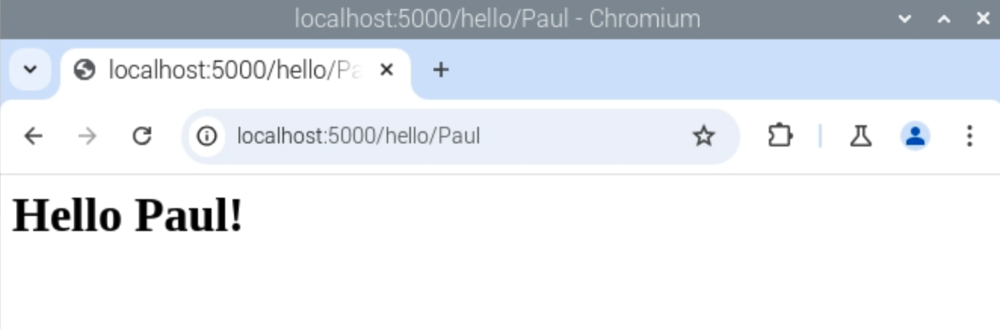

## Dynamic content

Websites like Facebook, YouTube and BBC News have dynamic content: these websites show different content within the same template.

Now you will create a new route on your website so that the page will show you a personalised greeting.
--- task ---

Open `app.py` and add a new route to your application:

--- code ---
---
language: python
line_numbers: true
line_number_start: 5
line_highlights: 9-11
---
@app.route('/')
def index():
    return render_template('index.html')

@app.route('/hello/<name>')
def hello(name):
    return render_template('page.html', name=name)
--- /code ---

--- /task ---

--- task ---

Create a new HTML template in the templates folder called `page.html`, and add the following HTML code to it:

--- code ---
---
language: html
line_numbers: true
---
<html>
<body>
<h1>Hello {{ name }}!</h1>
</body>
</html>
--- /code ---

--- /task ---

--- task ---

Save both files, then visit `localhost:5000/hello/Paul` in the **Chromium browser**. 

The page you see should look like this:



Try replacing `paul` in the address bar with a different name!

--- /task ---

--- task ---
Open your `index.html` template and add a link to the hello page under the heading.

--- code ---
---
language: html
line_numbers: true
line_number_start: 6
line_highlights: 7
---
<h1>My website</h1>
<a href="/hello/paul">Hi Paul</a>
--- /code ---

--- /task ---

--- task ---

Save the changes to `index.html`, and then open `localhost:5000` to see the updated version.


--- /task ---

--- collapse ---
---
title: How does this route work?
---

- `@app.route('/hello/<name>')`: the `<name>` part passes the text written in the URL into the `hello` function as a variable called `name`.
- `def hello(name)`: this is the function that determines what content is shown. Here, the function takes the given name as a parameter.
- `return render_template('page.html', name=name)`: this code looks up the template `page.html` and passes in the variable `name` from the URL so that the template can use it.


Flask uses `jinja`, a Python library for rendering templates. Look at this code with the braces (curly brackets):

```html
<h1>Hello {{ name }}!</h1>
```

This code tells the template to use the variable `name` that was passed in the route function `hello`.

Visiting `localhost:5000/hello/` without a name creates an error. 

--- /collapse ---