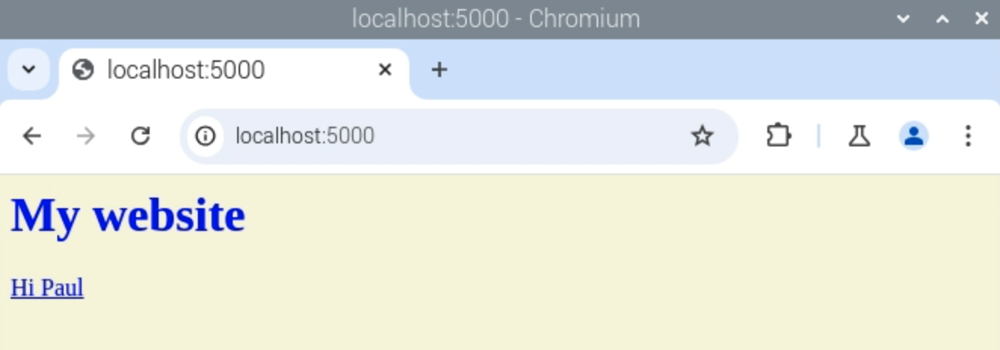

## Add dynamic content

Now you know how to deliver static HTML web pages using templates. Large websites like Facebook, YouTube and BBC News have dynamic content: these websites show different content depending on the page you visit, even though the templates are very similar.

You will now add some dynamic content to your pages so they can display different information. 

Now you will create a new route on your website so that when you go to `http://127.0.0.1/hello/name`, the page says 'Hello name!', replacing 'name' with whatever you put there. So for example, `/hello/Dana/` displays 'Hello Dana!'.

--- task ---

Add the following code to create a new route in your application:

```python
@app.route('/hello/<name>')
def hello(name):
    return render_template('page.html', name=name)
```

- `@app.route('/hello/<name>')`: the `<name>` part means it passes the name into the `hello` function as a variable called `name`.
- `def hello(name)`: this is the function that determines what content is shown. Here, the function takes the given name as a parameter.
- `return render_template('page.html', name=name)`: this code looks up the template `page.html` and passes in the variable `name` from the URL so that the template can use it.

--- /task ---

--- task ---

Create a new HTML template called `page.html`, and add the following HTML code to it:

```html
<html>
<body>
<h1>Hello {{ name }}!</h1>
</body>
</html>
```

--- /task ---

--- task ---

Save the files and visit `http://127.0.0.1:5000/hello/paul`. The page you see should look like this:


Try `http://127.0.0.1/hello/name` with different names!

--- /task ---

--- collapse ---

---
title: What's happening here?
---

Flask uses `jinja`, a Python library for rendering templates. Look at this code with the braces (curly brackets):

```html
<h1>Hello {{ name }}!</h1>
```

This code tells the template to render the variable `name` that was passed in the route function `hello`.

Visiting `127.0.0.1:5000/hello/` without a name creates an error. Try to think of a way to prevent this error.

--- /collapse ---

--- task ---

Create a link to your new, dynamic hello page from your index.

Edit `index.html` to add a link to the hello page under the heading.

```html
<h1>My website</h1>
<a href="/hello/paul">Hi Paul</a>
```

--- /task ---

--- task ---

Save the changes to `index.html`, and then refresh the index page in the browser to see the updated version.



--- /task ---
