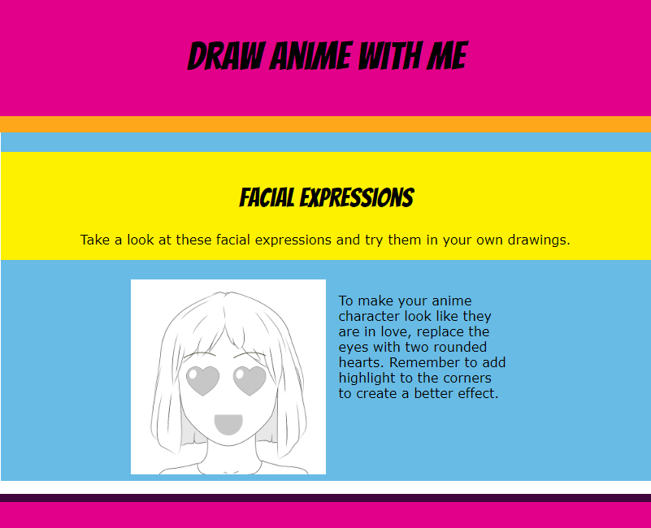

## What can you do now?

Try our [Introduction to web](https://projects.raspberrypi.org/pt-BR/pathways/web-intro) project pathway where you will learn how to structure and style webpages with images, lists, fonts, quotes, links, and animation.

--- print-only --- 

--- /print-only ---

--- no-print ---

<iframe src="https://editor.raspberrypi.org/pt-BR/embed/viewer/anime-expressions-complete" width="600" height="800" frameborder="0" marginwidth="0" marginheight="0" allowfullscreen> </iframe>

--- /no-print ---

Or, why not try out another [HTML and CSS](https://projects.raspberrypi.org/pt-BR/projects?software%5B%5D=html-css-javascript) project.

***
Este projeto foi traduzido por voluntários:

[name]

[name]

[name]

Graças a voluntários, podemos dar às pessoas de todo o mundo a chance de aprender em seu próprio idioma. Você pode nos ajudar a alcançar mais pessoas oferecendo-se para traduzir - mais informações em [rpf.io/translate](https://rpf.io/translate).
